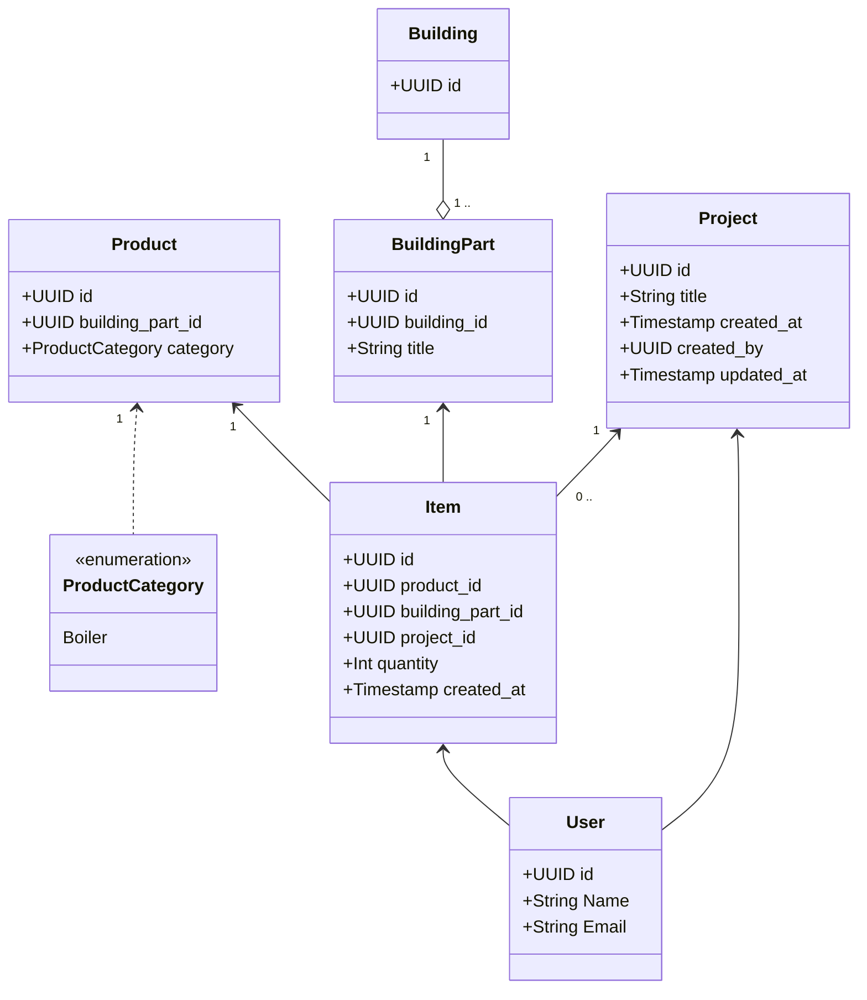

# Tender

## Schema

```mermaid
classDiagram
    Product "1" <.. ProductCategory
    Building "1" --o "1 .." BuildingPart

    BuildingPart "1" <-- Item
    Project "1" <-- "0 .." Item
    Product "1" <-- Item

    Project <-- User
    Item <-- User

    class User{
      +UUID id
      +String Name
      +String Email
    }
    class Project{
      +UUID id
      +String title
      +Timestamp created_at
      +UUID created_by
      +Timestamp updated_at
    }
    class Item{
      +UUID id
      +UUID product_id
      +UUID building_part_id
      +UUID project_id
      +Int quantity
      +Timestamp created_at
    }
    class Product{
      +UUID id
      +UUID building_part_id
      +ProductCategory category
    }
    class ProductCategory{
      <<enumeration>>
      Boiler
    }
    class Building{
      +UUID id

    }
    class BuildingPart{
      +UUID id
      +UUID building_id
      +String title
    }
```
